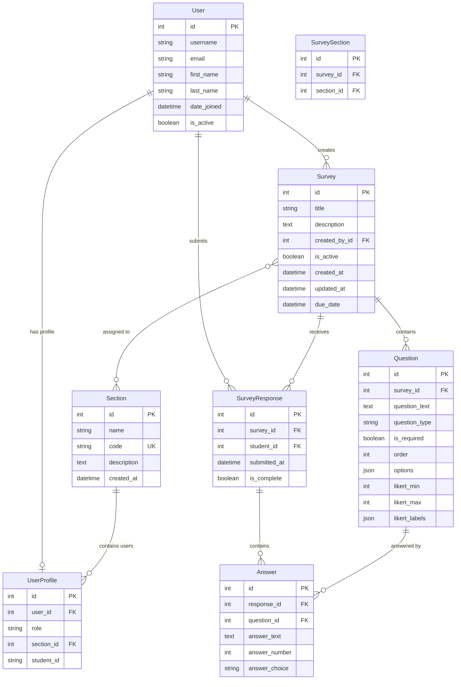

# Entity Relationship Diagram (ERD) - Survey System Database

## Database Schema Overview

Based on your Django models, here's the Entity Relationship Diagram for your survey system:

## Entity Descriptions

### Core Entities

1. **User** (Django's built-in User model)
   - Primary entity for authentication
   - Contains basic user information (username, email, names)

2. **Section**
   - Represents classes/courses
   - Has unique code identifier
   - Contains students and can be assigned surveys

3. **UserProfile**
   - Extends User with role and section information
   - One-to-one relationship with User
   - Roles: 'student' or 'teacher'
   - Links users to sections

4. **Survey**
   - Main survey entity
   - Created by teachers
   - Can be assigned to multiple sections
   - Has due dates and active status

5. **Question**
   - Individual questions within surveys
   - Supports multiple question types:
     - Multiple Choice
     - Likert Scale
     - Short Answer
     - Long Answer
   - Has ordering and requirement settings

6. **SurveyResponse**
   - Individual student responses to surveys
   - Unique constraint: one response per student per survey
   - Tracks completion status

7. **Answer**
   - Individual answers to specific questions
   - Flexible structure supporting different answer types
   - Unique constraint: one answer per question per response

## Key Relationships

- **User ↔ UserProfile**: One-to-one (extends user with role/section info)
- **User ↔ Survey**: One-to-many (teachers create surveys)
- **User ↔ SurveyResponse**: One-to-many (students submit responses)
- **Survey ↔ Question**: One-to-many (surveys contain multiple questions)
- **Survey ↔ SurveyResponse**: One-to-many (surveys receive multiple responses)
- **SurveyResponse ↔ Answer**: One-to-many (responses contain multiple answers)
- **Question ↔ Answer**: One-to-many (questions receive multiple answers)
- **Survey ↔ Section**: Many-to-many (surveys can be assigned to multiple sections)
- **Section ↔ UserProfile**: One-to-many (sections contain multiple users)

## Database Constraints

- **Unique Constraints**:
  - `(survey, student)` in SurveyResponse (one response per student per survey)
  - `(response, question)` in Answer (one answer per question per response)
  - `code` in Section (unique section codes)

- **Foreign Key Constraints**:
  - All foreign keys have CASCADE delete behavior
  - Ensures data integrity when parent records are deleted

## Question Types Support

The system supports flexible question types with specialized fields:

- **Multiple Choice**: Uses `options` JSON field for choices
- **Likert Scale**: Uses `likert_min`, `likert_max`, and `likert_labels` JSON
- **Short/Long Answer**: Uses `answer_text` field

This design allows for extensible question types while maintaining a normalized database structure.
